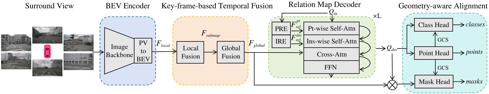
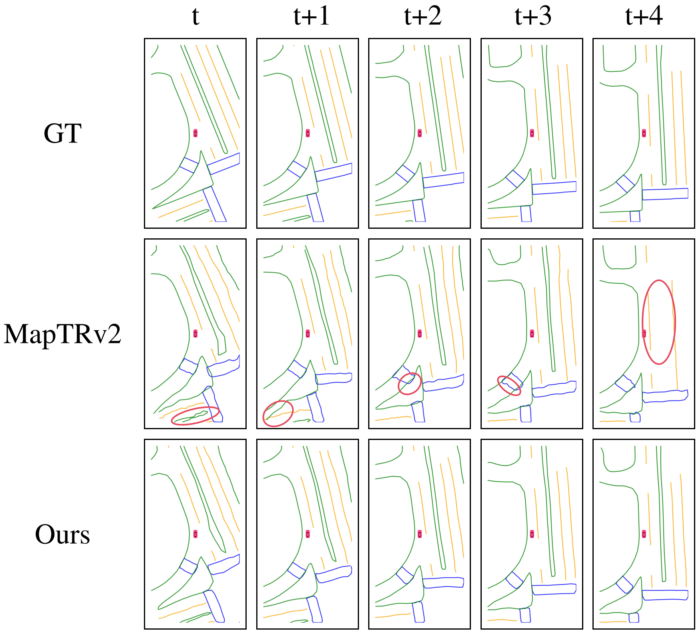
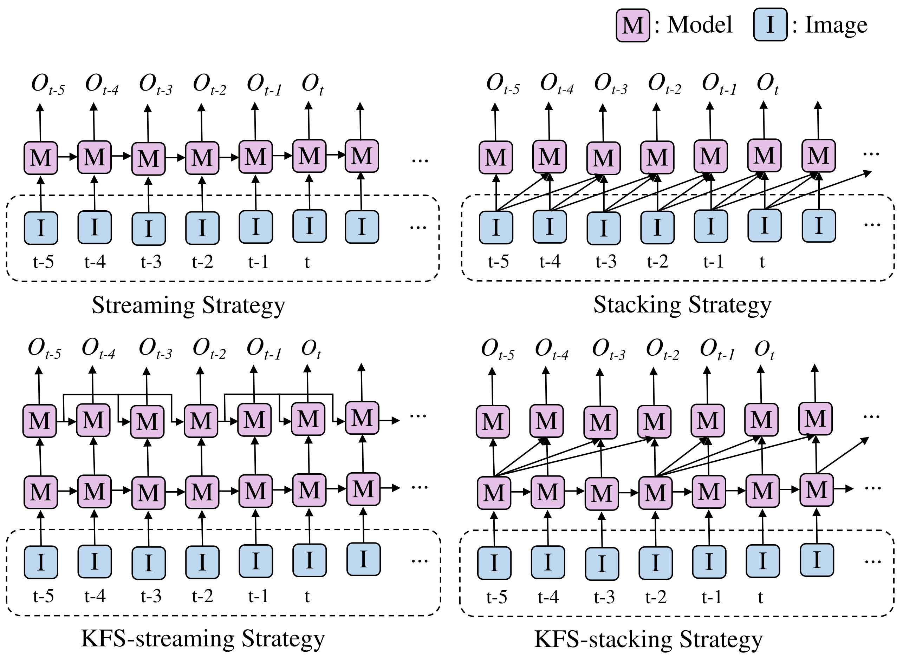
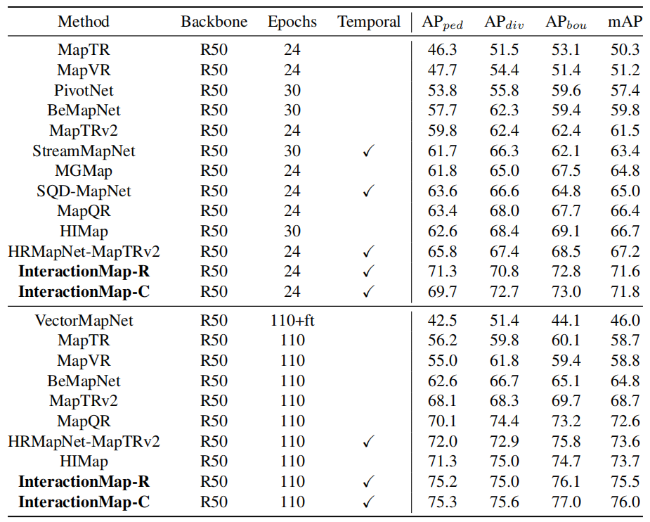

<div align="center">
  <h1>InteractionMap</h1>
  
  <h3>[CVPR 2025] Improving Online Vectorized HDMap Construction with Interaction </h3>
  Kuang Wu · Chuan Yang · Zhanbin Li

  Langge Technology

  [](https://arxiv.org/abs/2503.21659)
  [](https://kuangwu.github.io/interactionmap/)
  
  
</div>

#
### News
* **`Feb. 27th, 2025`:** :clap: Our **InteractionMap** is accepted by CVPR 2025 ! (**[Project](https://kuangwu.github.io/interactionmap/) , [Paper](https://arxiv.org/abs/2503.21659)**)
* **`Jun. 8th, 2024`:** :bulb: The **Innovation-Award** of the Mapless Driving-Challenge goes to our LGMap Solution ! (**[Tech-Report](https://arxiv.org/abs/2406.13988) , [Video](https://youtu.be/bTqRLw2ONKQ)**)
* **`Jun. 1st, 2024`:** :trophy: Our team win the **Championship** of the CVPR24 *Mapless Driving Challenge* ! (**[Leaderboard](https://opendrivelab.com/challenge2024/#mapless_driving)**)


<!-- Using HTML to center the abstract -->
<div class="columns is-centered has-text-centered">
    <div class="column is-four-fifths">
        <h2>Abstract</h2>
        <div class="content has-text-justified">
Vectorized high-definition (HD) maps are essential for
an autonomous driving system. Recently, state-of-the-art
map vectorization methods are mainly based on DETR-like
framework to generate HD maps in an end-to-end manner.
In this paper, we propose InteractionMap, which improves previous map vectorization methods by fully leveraging local-to-global information interaction in both time
and space.
Firstly, we explore enhancing DETR-like detectors by explicit position relation prior from point-level to instance-level, since map elements contain strong shape priors.
Secondly, we propose a key-frame-based hierarchical temporal fusion module, which interacts temporal information from local to global.
Lastly, the separate classification branch and regression branch lead to the problem of misalignment in the output distribution.
We interact semantic information with geometric information by introducing a novel geometric-aware classification loss in optimization and a geometric-aware matching cost in label assignment. InteractionMap achieves state-of-the-art performance on both nuScenes and Argoverse2 benchmarks.
        </div>
    </div>
</div>

---


## Motivation
- **Vectorized high-definition (HD) maps** are essential for an autonomous driving system.<br>
The map elements predicted by existing HD map models often suffer from distortion and jitter, which directly impact downstream tasks.    There are mainly three reasons:<br>
  <div>1. The inconsistency between the classification probability and the geometric quality of the map elements.
  <div>2. The lack of inter-instance and intra-instance interactions.
  <div>3. The long-duration map element occlusion caused by moving vehicles.




## Method
- We propose **InteractionMap**, which improves previous map vectorization methods by fully leveraging local-to-global information interaction in both time and space.

- **Geometry-aware alignment module** is designed to solve the misalignment problem of classification and position output by leveraging the **interaction between semantic information and geometry information**.
- **Relation map decoder** utilizes explicit position relation embedding method from point to instance, efficiently employing progressive **interaction of point-wise information and instance-wise information**.
- **Key-frame-based temporal fusion module** leverage **temporal information interaction from local to global**.




## Result

- Comparison with SOTA methods on the nuScenes validation set




- We visualize results of InteractionMap in sequential frames under the condition of cloudy,
sunny, rainy and nighttime respectively.


## Citation
```
@article{wu2025interactionmap,
  title={InteractionMap: Improving Online Vectorized HDMap Construction with Interaction},
  author={Wu, Kuang and Yang, Chuan and Li, Zhanbin},
  journal={arXiv preprint arXiv:2503.21659},
  year={2025}
}
```
